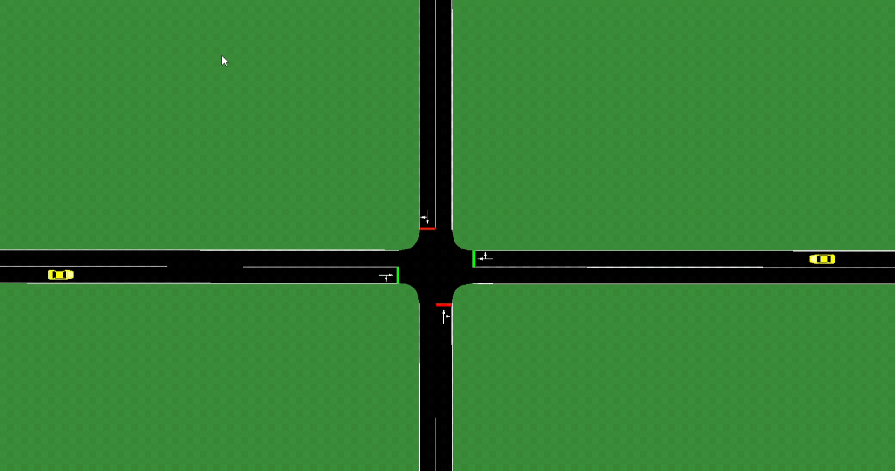
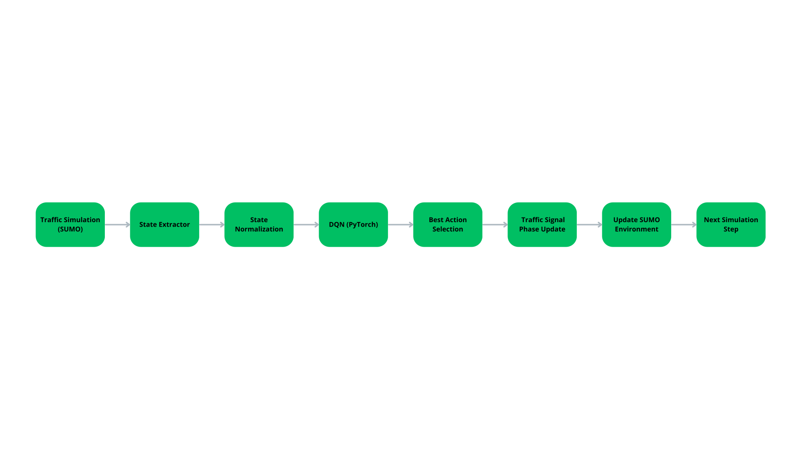

# 🚦 Smart Traffic Light using Deep Reinforcement Learning

[]()
[]()
[]()
[]()
[]()

A Deep Reinforcement Learning approach for adaptive traffic signal control using **SUMO (Simulation of Urban MObility)** and **PyTorch**.

Instead of using fixed traffic light cycles, the agent continuously observes traffic conditions and learns to select the optimal signal phase to reduce congestion and improve traffic flow.

<p align="center">
  
</p>

<p align="center">
<b>Deep Q-Network agent controlling a traffic intersection in SUMO.</b>
</p>

---

## 📖 Overview

Traditional traffic lights operate with predefined timing plans that cannot adapt to changing traffic conditions.

This project applies **Deep Q-Networks (DQN)** to create an intelligent traffic signal controller capable of learning optimal decisions directly from interaction with the traffic simulator.

The trained model receives the current traffic state, predicts the expected reward of each possible action, and dynamically controls the traffic lights during the simulation.

---

## ✨ Features

- Deep Reinforcement Learning (DQN)
- PyTorch Neural Network
- SUMO Traffic Simulation
- Real-Time Traffic Light Control
- Adaptive Decision Making
- Pre-trained Model Included
- Modular Python Implementation

---

## 🏗 Project Structure

```text
smart-traffic-light-dqn/

│
├── models/
│   └── best_traffic_dqn.pt
│
├── notebooks/
│   └── training.ipynb
│
├── config/
│   ├── intersection.sumocfg
│   ├── intersection.net.xml
│   ├── intersection.rou.xml
│   └── traffic_lights.tll.xml
│
├── src/
│   └── main.py
│
├── assets/
│   ├── architecture.svg
|   ├── Reinforcement Learning Loop.svg
│   ├── simulation.gif
│   └── convergence.png
│
├── README.md
├── requirements.txt
└── LICENSE
```

---

## ⚙️ System Architecture

<p align="center">
  
</p>

---

## 🧠 Deep Reinforcement Learning

The project uses a **Deep Q-Network (DQN)** to approximate the optimal action-value function.

At each simulation step the agent:

1. Observes the current traffic state.
2. Predicts the Q-value for each available action.
3. Selects the action with the highest expected reward.
4. Updates the traffic signal.
5. Receives a new state and repeats the process.

<p align="center">
  
</p>

---

## 📊 State Representation

The neural network receives information extracted from the SUMO simulation, including:

- Vehicle queue lengths
- Current traffic light phase
- Waiting vehicles
- Simulation time
- Traffic conditions

These features describe the environment observed by the reinforcement learning agent.

---

## 🎯 Action Space

The agent can decide whether to:

- Keep the current traffic light phase
- Switch to another traffic light phase

Future versions may include dynamic green time adjustment.

---

## 🛠 Technologies

- Python
- PyTorch
- SUMO
- TraCI API
- NumPy

---

## 🚀 Installation

Clone the repository.

```bash
git clone https://github.com/Daniel-Lmv/smart-traffic-light-dqn.git
```

Open the project.

```bash
cd smart-traffic-light-dqn
```

Install dependencies.

```bash
pip install -r requirements.txt
```

Install SUMO.

https://sumo.dlr.de/docs/Downloads.php

Configure the SUMO_HOME environment variable.

---

## ▶ Running

Start the simulation.

```bash
python src/main.py
```

The trained model (`best_traffic_dqn.pt`) will automatically be loaded.

---

## 📈 Results

The trained Deep Q-Network learns to adapt traffic signal decisions according to the observed traffic conditions, reducing congestion compared to static traffic light control.

Future versions will include:

- Performance metrics
- Waiting time comparison
- Reward curves
- Traffic flow statistics

---

## 🔬 Future Improvements

- Double DQN
- Dueling DQN
- Prioritized Experience Replay
- Multi-Agent Reinforcement Learning
- Larger road networks
- Real-world traffic datasets
- Dashboard for performance visualization

---

## 📚 References

- Mnih et al. (2015). Human-level control through deep reinforcement learning.
- SUMO - Simulation of Urban Mobility
- PyTorch Documentation

---

## 👨‍💻 Author

**Daniel Limaverde da Silva**

Artificial Intelligence Student

Federal University of Rio Grande do Norte (UFRN)

GitHub: https://github.com/Daniel-Lmv

LinkedIn: www.linkedin.com/in/daniel-limaverde

---

## ⭐ Support

If you found this project useful, consider giving it a **star ⭐** on GitHub.

Contributions, suggestions and improvements are always welcome.
